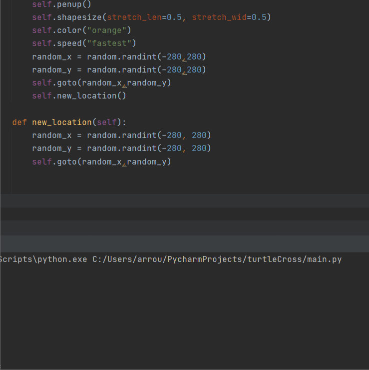

## 100 Days Of Code With Python

# Day 21 & 22

  

#### The Classic Snake game created using Python and the Turtle module for the graphical interface. The game utilizes a lot of OPP concepts since most of the main components(snake,food,scoreboard) are objects.

You can view this application live by clicking [this link.](https://repl.it/@ArisRoutsis/Snake-Game#main.py)
