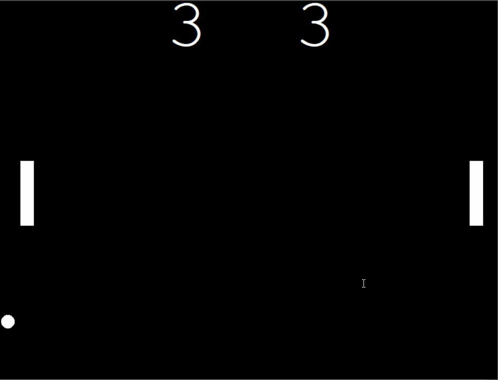

## 100 Days Of Code With Python

# Day 23

### Pong Game

  

#### The Classic Pong game created using Python and the Turtle module for the graphical interface. The game utilizes a lot of OPP concepts since most of the main components(paddle,ball,scoreboard) are objects.

You can view this application live by clicking [this link.](https://repl.it/@ArisRoutsis/Pong-Game#main.py)
