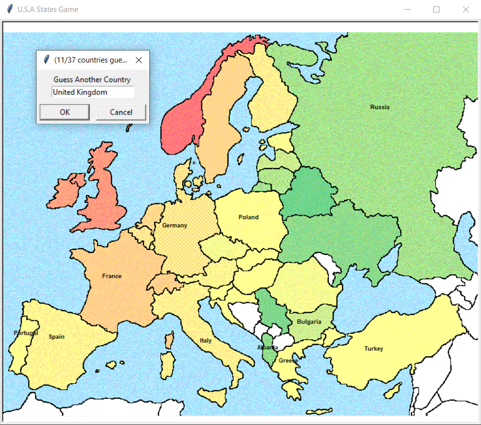

## 100 Days Of Code With Python

# Day 26

  

### About This Project

#### This is game a game that was created with Python and it utilizes the Turtle module for the graphical interface and the Pandas library to manipulate csv files. In this game the user can try to guess all the countries of European Continent. If the user manages to guess all the countries correctly they win. Else if the user decides to exit a new csv file will be created that will include the countries that they failed to guess. You can view this application live by clicking [this link.](https://repl.it/@ArisRoutsis/Guess-The-European-Country-Game#main.py)

### Technologies Used

- ##### Python 3
- ##### Turlte Module
- ##### Pandas Library
