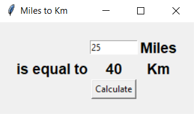

## 100 Days Of Code With Python

# Day 29

  

### About This Project

#### This is a simple calculator that the user can input miles and convert them to Km. The UI of this application was made using Tkinter. You can view this application live by clicking [this link.](https://repl.it/@ArisRoutsis/MilesToKm#main.py)

### Technologies Used

- ##### Python 3
- ##### Tkinter
