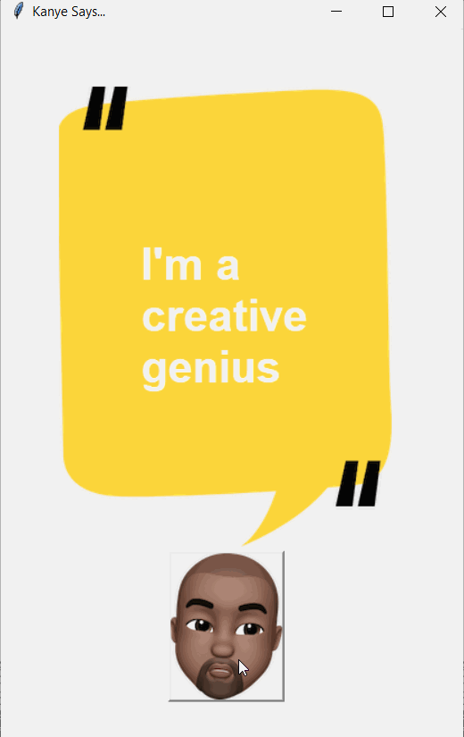

## 100 Days Of Code With Python

# Day 31

  

### About This Project

#### In this project I used the Kanye Rest API to along the requests module and Tkinter to make a simple GUI program where the user can view different Kanye West quotes by pressing a button. You can view this application live by clicking [this link.](https://repl.it/@ArisRoutsis/Kanye-Quote-Api#main.py)

### Technologies Used

- ##### Python 3
- ##### Tkinter
