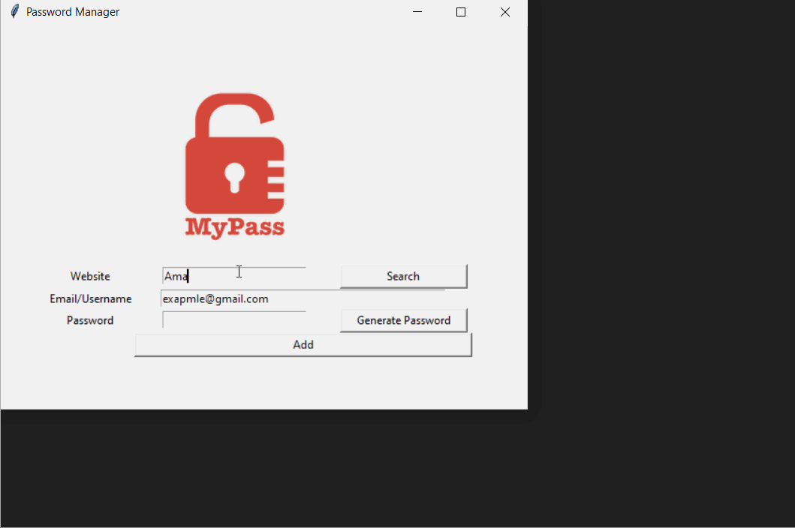

## 100 Days Of Code With Python

# Day 32 & Day 33

## Password Manager

  

### About This Project

#### This is an application that allows the user to manage his passwords. The user can input and save their passwords. After a password is saved the user can use the search functionality to find saved passwords by imputing the website's name. If a password is found for the inputed website then the password will automaticaly be copied into the clipboard.

#### The UI was created using Tkinter. I used grid for the ui layout. The saving/storing/reading information part of the application is done using the json file format. The pyperclip module was also utilized to auto copy the password into the clipboard. You can view this application live by clicking [this link.](https://repl.it/@ArisRoutsis/Password-Manager#main.py)

### Technologies Used

- ##### Python 3
- ##### Tkinter
- ##### PyperClip
