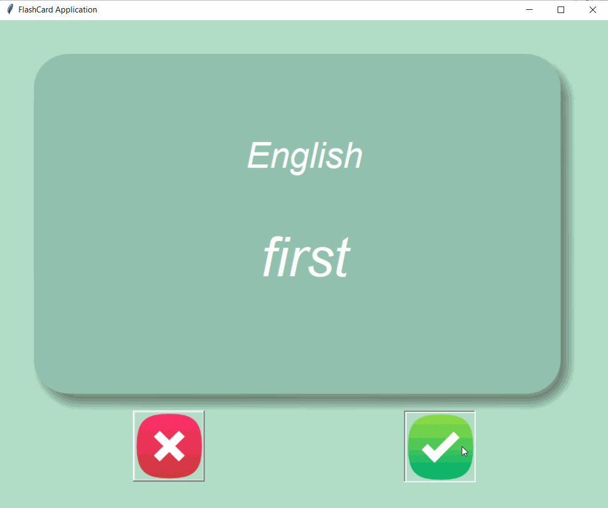

## 100 Days Of Code With Python

# Day 34

## FlashCard Application

  

### About This Project

#### This is a falsh card application. It allows users to practice learing words by using the Flashcard method. The user has 3 secconds to guess the word. If they guess correctly the card will be removed from the list of uknown words else the card will reaper in the future.

#### The UI was created using Tkinter. I used grid for the ui layout. The saving/storing/reading information part of the application is done using csv files. You can view this application live by clicking [this link.](https://repl.it/@ArisRoutsis/FlashCard-Application#main.py)

### Technologies Used

- ##### Python 3
- ##### Tkinter
- ##### Pandas
