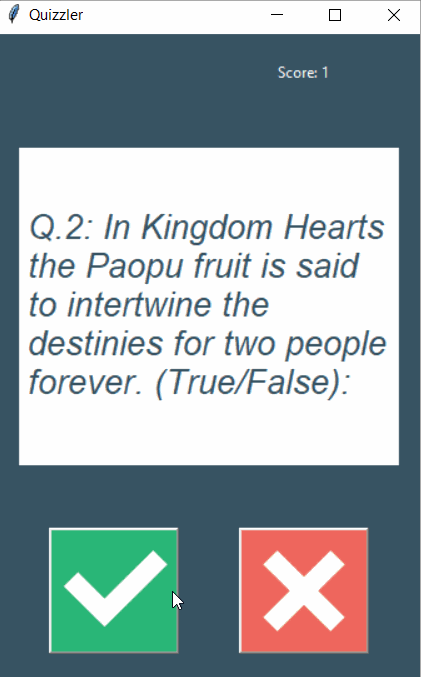

## 100 Days Of Code With Python

# Day 37

## GUI Quiz Game

  

### About This Project

#### This application uses the Trivia API from Open Trivia Database to get a set of 10 random questions. The application then will display the questions to the user.

#### The UI of this aplication was make with Tkinter and the the layout using grid. The requests module was used to get the api data. A lot of the funtionality of this application was implemented by creating multiple classes. You can view this application live by clicking [this link.](https://repl.it/@ArisRoutsis/GUI-Quiz-Game#main.py)

### Technologies Used

- ##### Python 3
- ##### Tkinter
- ##### Requests Module
- ##### Trivia API
