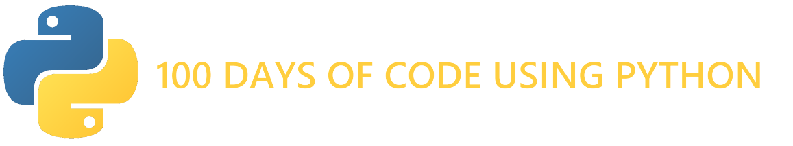

  

### The 100 days of code challenge using the Python programming language

## Projects

- ###### Day 26 [Repository](https://github.com/ArmantoArisRoutsis/100_Days_Of_Code/tree/main/Day-26__Guess-The-State-Game) || [View Live](https://repl.it/@ArisRoutsis/Guess-The-State-Game#main.py)
- ###### Day 25 [Repository](https://github.com/ArmantoArisRoutsis/100_Days_Of_Code/tree/main/Day-25__Mail-Merge) || [View Live](https://repl.it/@ArisRoutsis/Mail-Merge#main.py)
- ###### Day 24 [Repository](https://github.com/ArmantoArisRoutsis/100_Days_Of_Code/tree/main/Day-24__Turtle-Crossing-Game) || [View Live](https://repl.it/@ArisRoutsis/Turtle-Crossing-Game#main.py)
- ###### Day 23 [Repository](https://github.com/ArmantoArisRoutsis/100_Days_Of_Code/tree/main/Day-23__Pong-Game) || [View Live](https://repl.it/@ArisRoutsis/Pong-Game#main.py)
- ###### Day 21 & Day 22 [Repository](https://github.com/ArmantoArisRoutsis/100_Days_Of_Code/tree/main/Day-21_%26_Day-22__Snake-Game) || [View Live](https://repl.it/@ArisRoutsis/Snake-Game#main.py)
- ###### Day 20 [Repository](https://github.com/ArmantoArisRoutsis/100_Days_Of_Code/tree/main/Day-20__Turtle-Racing) || [View Live](https://repl.it/@ArisRoutsis/Turtle-Racing#main.py)
- ###### Day 19 [Repository](https://github.com/ArmantoArisRoutsis/100_Days_Of_Code/tree/main/Day-19__Etch-A-Sketch) || [View Live](https://repl.it/@ArisRoutsis/Sketch#main.py)
- ###### Day 18 [Repository](https://github.com/ArmantoArisRoutsis/100_Days_Of_Code/tree/main/Day-18__Hirst_Painting-Project) || [View Live](https://repl.it/@ArisRoutsis/RegalDryIde#main.py)
- ###### Day 17 [Repository](https://github.com/ArmantoArisRoutsis/100_Days_Of_Code/tree/main/Day-17__OOP-Quiz-Project) || [View Live](https://repl.it/@ArisRoutsis/quiz-game#main.py)
- ###### Day 16 [Repository](https://github.com/ArmantoArisRoutsis/100_Days_Of_Code/tree/main/Day-16__OOP-Coffee-Machine) || [View Live](https://repl.it/@ArisRoutsis/coffee-machine#main.py)
- ###### Day 15 [Repository](https://github.com/ArmantoArisRoutsis/100_Days_Of_Code/tree/main/Day-15__Coffee-Machine) || [View Live](https://repl.it/@ArisRoutsis/coffee-machine#main.py)
- ###### Day 13 & Day 14 [Repository](https://github.com/ArmantoArisRoutsis/100_Days_Of_Code/tree/main/Day-13_%26_Day-14__Higher-Lower) || [View Live](https://repl.it/@ArisRoutsis/higher-lower#main.py)
- ###### Day 12 [Repository](https://github.com/ArmantoArisRoutsis/100_Days_Of_Code/tree/main/Day-12__Guess-The-Number) || [View Live](https://repl.it/@ArisRoutsis/guess-the-number#main.py)
- ###### Day 11 [Repository](https://github.com/ArmantoArisRoutsis/100_Days_Of_Code/tree/main/Day-11__BlackJack) || [View Live](https://repl.it/@ArisRoutsis/blackjack#art.py)
- ###### Day 10 [Repository](https://github.com/ArmantoArisRoutsis/100_Days_Of_Code/tree/main/Day-10__Calculator) || [View Live](https://repl.it/@ArisRoutsis/calculator-final#main.py)
- ###### Day 09 [Repository](https://github.com/ArmantoArisRoutsis/100_Days_Of_Code/tree/main/Day-09__Secret-Auction-Program) || [View Live](https://repl.it/@ArisRoutsis/blind-auction-start#main.py)
- ###### Day 08 [Repository](https://github.com/ArmantoArisRoutsis/100_Days_Of_Code/tree/main/Day-08__Caesars-Chipher) || [View Live](https://repl.it/@ArisRoutsis/caesar-cipher-1-start#main.py)
- ###### Day 07 [Repository](https://github.com/ArmantoArisRoutsis/100_Days_Of_Code/tree/main/Day-07__Hangman-game) || [View Live](https://repl.it/@ArisRoutsis/Day-7-Hangman-2-Start#main.py)
- ###### Day 06 [Repository](https://github.com/ArmantoArisRoutsis/100_Days_Of_Code/tree/main/Day-06__Escaping-The-Maze) || [Test Live](https://reeborg.ca/reeborg.html?lang=en&mode=python&menu=worlds%2Fmenus%2Freeborg_intro_en.json&name=Maze&url=worlds%2Ftutorial_en%2Fmaze1.json)
- ###### Day 05 [Repository](https://github.com/ArmantoArisRoutsis/100_Days_Of_Code/tree/main/Day-05__Password-Generator) || [View Live](https://repl.it/@ArisRoutsis/password-generator-start#main.py)
- ###### Day 04 [Repository](https://github.com/ArmantoArisRoutsis/100_Days_Of_Code/tree/main/Day-04__Rock-Paper-Scissors) || [View Live](https://repl.it/@ArisRoutsis/rock-paper-scissors-start#main.py)
- ###### Day 03 [Repository](https://github.com/ArmantoArisRoutsis/100_Days_Of_Code/tree/main/Day-03__Treasure-Island) || [View Live](https://repl.it/@ArisRoutsis/treasure-island-start-1#main.py)
- ###### Day 02 [Repository](https://github.com/ArmantoArisRoutsis/100_Days_Of_Code/tree/main/Day-02__Tip-Calculatory) || [View Live](https://repl.it/@ArisRoutsis/tip-calculator-start#main.py)
- ###### Day 01 [Repository](https://github.com/ArmantoArisRoutsis/100_Days_Of_Code/tree/main/Day-01__Band-Name-Generator) || [View Live](https://repl.it/@ArisRoutsis/band-name-generator-start#main.py)
